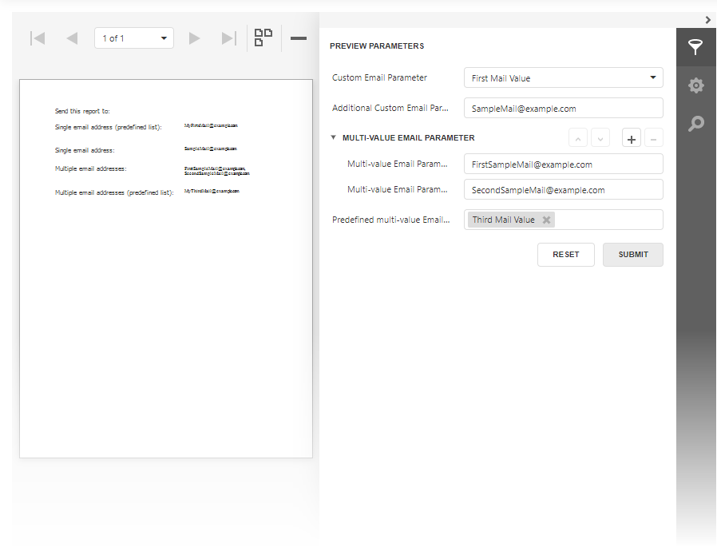

<!-- default badges list -->

<!-- default badges end -->
# Custom Report Parameter Types in Web Reporting Controls (ASP.NET Core)

This example demonstrates how to use custom types for report parameters, create custom parameter editors, and implement serialization/deserialization logic. 

<!-- default file list -->
## Files to look at

- [CustomParameterType.cs](CS/CustomParameterEditorAspNetCoreExample/Services/CustomParameterType.cs)
- [CustomDataSerializer.cs](CS/CustomParameterEditorAspNetCoreExample/Services/CustomDataSerializer.cs)
- [TestReport.cs](CS/CustomParameterEditorAspNetCoreExample/PredefinedReports/TestReport.cs)
- [HomeController.cs](CS/CustomParameterEditorAspNetCoreExample/Controllers/HomeController.cs)
- [Viewer.cshtml](CS/CustomParameterEditorAspNetCoreExample/Views/Home/Viewer.cshtml)
<!-- default file list end -->

**See also**:

- <a href="https://docs.devexpress.com/XtraReports/4812/detailed-guide-to-devexpress-reporting/shape-report-data/use-report-parameters">Use Report Parameters</a>
- <a href="https://docs.devexpress.com/XtraReports/402406/web-reporting/asp-net-core-reporting/tasks-and-solutions-for-asp-net-core-applications">Tasks and Solutions for ASP.NET Core Applications</a>

<!-- feedback -->
## Does this example address your development requirements/objectives?

 

(you will be redirected to DevExpress.com to submit your response)
<!-- feedback end -->
